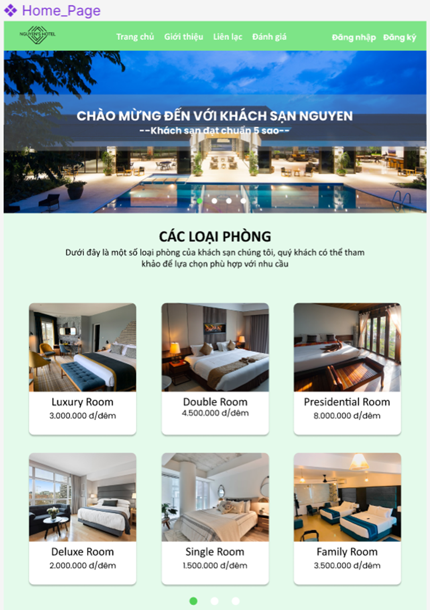

# Furniture Store Website

This is a project for creating a Furniture Store Website. The website aims to provide users with a convenient platform to browse and purchase furniture items online.

## Table of Contents
- [Features](#features)
- [Technologies Used](#technologies-used)
- [Demo](#demo)
- [Contributors](#contributors)

## Features
- Browse furniture items by category
- Search for specific items
- View details of each furniture item
- Add items to cart
- Checkout functionality
- User authentication and authorization
- Admin dashboard for managing products and orders

## Technologies Used
- C#
- ASP.NET Core MVC
- Entity Framework Core
- HTML5
- CSS3
- JavaScript
- Bootstrap 4
- JQuery
- MySQL
## Demo

## Contributors
- Duong Duc Nguyen - Back-end Developer - https://github.com/silverhand02
- Tran Quang Minh - Back-end Developer
- Nguyen Thanh Loc - Front-end Developer - https://github.com/ngthloc1803

